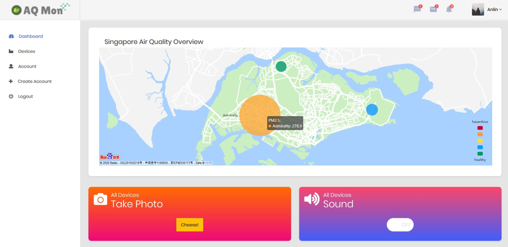

# AQ Mon Air Quality Monitoring System
AQ Mon is a scalable air quality monitoring platform with smart alerts, an analytical and motion-based self-defense system, used to monitor the air quality of multiple locations in the form of PM2.5 and PM10 readings. It can be controlled via a web interface or a Telegram bot.

The web interface allows for the viewing of real-time PM2.5 and PM 10 readings, as well as the controlling of all devices attached to AQ Mon.

Configurable PM2.5 and PM10 threshold values act as triggers for the AQ Mon alert system. When these thresholds are exceeded, an SMS alert is sent, a warning LED is lit up, and an image of the monitored location is taken. This image is run through an image recognition algorithm to generate labels to detect the cause of the spike in PM readings. Analytics in the form of historical air quality graphs across different time ranges can be viewed through the web interface. 

Upon investigation, a warning buzzer can be turned on and off, either through the web interface or Telegram bot, to warn the subjects being monitored that their activities are causing air pollution.

A Telegram bot is implemented as a way to interact with AQ Mon. Through the Telegram bot, users may get the PM2.5 and PM10 readings, control the warning buzzer, and initiate photo taking for one or all of the connected devices.

Motion-initiated photo acts as a self-defense system and acts as a deterrence to tampering. It also serves as evidence in such situations.

The user login, access control, account management, and password reset systems are in place for the AQ Mon web server.

> **AQ Mon Introductory Video: [Link](https://www.youtube.com/watch?v=NMMhP3iBm_k&feature=youtu.be)**

## Table of Contents
1. [AQ Mon in Pictures](#aq-mon-in-picutres)
2. [Technologies Used](#technologies-used)
3. [System Architecture](#system-architecture)
4. [Hardware Setup](#raspberry-pi-hardware-setup)
5. [Software Setup](#software-setup)


## AQ Mon in Picutres
**Main Dashboard (All Devices)**


**Device-Specific Dashboard**


**User Login System**


**Password Reset**


**Custom Error Pages**


## Technologies Used
- AWS IoT Core
- AWS DynamoDB
- AWS S3/S3 Events
- AWS Rekognition
- AWS Lambda
- AWS Database Streaming
- AWS EC2
- MQTT
- Flask
- Flask-login
   - Flask login manager for access controls. 
- Flask-mail
   - Sending emails with email server and account details provided
- Flask Blueprint
- TimedJSONWebSignatureSerializer
   - Generates one-time password reset URLs and able to store information such as user ID with the URL for verification purpose.
- PynamoDB
   - Object-Relation Mapper.
   - Access database in an object-oriented way.
- WTForms
   - Create forms as classes.
- Bcrypt
   - Generating cryptographically secure hash for user passwords.
- Jinja
   - HTML Template inheritance.
- Bootstrap
- Baidu Maps API

### Libraries Used
- AWSIoTPythonSDK
- boto3
- Gpiozero
  - For different standard IoT devices; e.g. LED, Motion Sensor
- PiCamera
  - For camera module on the Raspoberry Pi. 
- Twilio API
  - For sending SMS alerts.
- Telepot API
  - For Telegram bot.
- ECharts
  - Javascript visualization library to view historical air quality data as graphs.

## System Architecture


## Raspberry Pi Hardware Setup

### Hardware Checklist
- 1 x SDS011 PM sensor
- 1 x LED
- 1 x 330 Ω resistor
- 1 x PIR Motion Sensor
- 1 x Buzzer
- 1 x LCD (2 x 16)
- 1 x RaspberryPi with Camera Module
  
 

### Fritzing Diagram


### SDS011 Driver Installation
The SDS011 sensor connects to Raspberry Pi via USB. However, the Raspbian system does not have the driver for the specific USB device used by the sensor.

To install the driver:

```bash
sudo apt-get install raspberrypi-kernel-headers # Install header files in order to compile/make the driver
git clone https://github.com/skyrocknroll/CH341SER_LINUX.git
cd CH341SER_LINUX
sudo make
modinfo ch341 # To confirm driver kernel module installed successfully.
dmesg | grep ‘ch341-uart converter now attached to ttyUSB0’ # To confirm Raspberry has attached SDS011 to ttyUSB0.
```

## Software Setup

### Setting up the necessary configuration files
Edit the “config.json” in project folder for all configurations need to be set:
(Refer to “config.json” for example value of each)

### Generating AWS credentials
1. Login to your AWS Account. On the dashboard, select ‘Account Details’ then ‘AWS CLI’
2. Save the provided access keys to a file named ‘credentials’
3. Move the ‘credentials’ file to where the AWS setup script can read it
4. On Windows this is C:\Users\<your user>\.aws\
5. On Linux this is ~/.aws/ where ~ is your home directory
6. Run setup_aws.py found in the project folder
    - Creates the necessary database tables in AWS DynamoDB
    - Creates an admin account for the web interface with credentials defined in config.json
    - Creates the S3 bucket for storing captured images

### Setting up AWS Services
From the same dashboard above, click on ‘AWS Console’. AQ Mon utilises multiple AWS Lambda functions that are called in different AWS functions.

For each section below, the AWS service involved will be listed in parentheses. These can be found from the main page of the AWS console under ‘Find All Services’

Lambda functions that need to be created will be denoted like this

The code for each lambda function can be found in “aqmonitoring/aws_lambda” inside the project folder with the prefix “lambda_<function name>”

Additionally, permissions have to be configured for each lambda function that has to be created. These can be found under Services > Lambda. The specific permissions for each lambda function are listed below.

#### 1.	IoT Functions (IoT Core)
Click on ‘Act’
Create each rule as specified below.
- DynamoDB Status
  -	Rule query statement: SELECT * FROM 'status/+'
  -	Actions: Send a message to a Lambda function iot_update_status
- AQ_SMS
  -	Rule query statement: SELECT * FROM 'aq/sms'
  -	Actions: Send a message to a Lambda function aq_alert_sms
  -	Special instructions needed to create this lambda function in AWS are required, and can be found in the python file
- DynamoDB_AQ
  -	Rule query statement: SELECT * FROM 'aq'
  -	Actions: Split message into multiple columns of a DynamoDB table (DynamoDBv2)
  -	Table name: AirQuality
- AQ_Image
  -	Rule query statement: SELECT *, topic(3) AS device_id from 'aq/image/+'
  -	Actions: Send a message to a Lambda function aq_image_mqtt
#### 2.	Database Functions (DynamoDB)
  - Click on the ‘Tables’ tab on left-hand side
  - Select the ‘Status’ table
  - Create a new Trigger with the lambda function db_publish_status
#### 3.	S3 Functions (S3)
  - Select ‘aq-s3-bucket’ and then ‘Properties’
  - Under ‘Events’, create a new Event
    - Name: AQImageUploaded
    - Events: All object create events
    - Filter: .jpg
    - Lambda function: aq_image_upload

| Function Name     | Permissions Required | Description  |
| ------------------|----------------------| ------------ |   
| iot_update_status | Full access to DynamoDB | Listens on ‘status/+’ topic, subscribes to this topic which publishes changes to any IoT device components such as LED, Buzzer and updates the changes to any device components to the database so that the web component is notified
| aq_alert_sms      | Basic Lambda Execution | IoT devices will publish to ‘aq/sms’ topic when PM thresholds are exceeded on an hourly basis<br>Subscribes to the ‘aq/sms’ topic and sends SMS alerts to configured handphone number via Twilio API
| aq_image_mqtt     | GetObject, PutObject to S3 | IoT devices will publish image taken when PM readings exceed threshold to ‘aq/image’ topic<br>This function subscribes to the topic and decodes the Base64 encoded image to bytes and uploads it to the S3 bucket with the name specified in the MQTT message payload 
| db_publish_status | Full access to AWS IoT<br>DescribeStream, GetRecords, GetShardIterator, ListStreams for DynamoDB | Streams on any change in a record in the ‘Status’ table of DynamoDB. A change in records signifies a change in a device component’s state. <br>Publishes the new record value to the 'status/&lt;device_id&gt;/&lt;component&gt;’ topic so that the devices will be notified and can update their components’ statuses accordingly
| aq_image_upload   | Full Access to DynamoDB<br>AWS Rekognition<br>GetObject, PutObject to S3 | Triggers on an S3 object creation, which will be the image uploaded by the Lambda function aq_image_mqtt when PM thresholds are exceeded<br>Performs image recognition on the uploaded image with AWS Rekognition and stores the labels detected with the name in the format of &lt;device_id&gt;_&lt;random_hex&gt;.jpg into the ‘AQImage’ table in DynamoDB for the web interface to retrieve

#### 4. Creating an EC2 Instance to host the web server
1. AWS EC2 Setup Process https://aws.amazon.com/ec2/getting-started/
2. Create an EC2 instance (Ubuntu 18 used). Make sure public IP will be assigned. Tick the option when configuring the instance
3. Create an role for the EC2 instance. Make sure it has full access to AWS IOT, DynamoDB, S3
4. Add a rule to the security group attached to your instance to allow inbound traffic on port 5000. https://docs.aws.amazon.com/AWSEC2/latest/UserGuide/authorizing-access-to-an-instance.html
5. Transfer the web_app folder to the EC2 instance
6. Install the following packages
    - sudo apt-get update
    - sudo apt-get install build-essential libssl-dev libffi-dev
    - sudo apt-get install gcc libpq-dev -y
    - sudo apt-get install python-dev  python-pip -y
    - sudo apt-get install python3-dev python3-pip python3-venv python3-wheel -y
    - pip3 install wheel
7. In the web_app directory, create an python3 virtual environment
8. Install the the packages in requirements.txt with pip install -r requirements.txt
9. Make sure the config.json is filled up properly. E.g. mqtt_client_name and the certs and private keys required by MQTT client is inside the web_app directory.
10. Run the web app with python3 run.py -t
11. If the Gmail fails to send password reset email due to Google security:
    - Enable allow less secure app http://stackoverflow.com/questions/26852128/smtpauthenticationerror-when-sending-mail-using-gmail-and-python
    - Unlock Captcha to allow your Gmail account from sending location at the AWS instance https://stackoverflow.com/questions/35659172/django-send-mail-from-ec2-via-gmail-gives-smtpauthenticationerror-but-works

### Registering All Devices to the AQ Mon Platform
Populate the 'all_device_id' field in config.json with device ids intend to be put on the air quality devices and their respective geography coordinates that will be used to display each device on a map in web portal.

Run setup-device.py to register the device_ids defined in config.json
``` bash
python setup-device.py
```
### Setting Up Individual Devices
For each device that has to be tracked by AQ Mon, the following must be performed to configure the device appropriately to run the monitoring program.

#### 1. Setting Up Device Configurations
- Register the device in AWS IoT Core, and obtain the certificate, private key files for the device
- Place the certs in “aq_monitoring” folder found in the root project folder
- Configure device_config.json found in “aq_monitoring” . The following needs to be updated
  - ‘aws_host’, ‘aws_root_ca’, ‘aws_certificate’ and ‘aws_private_key’ should correspond to the information obtained by registering the device in IoT Core
  -‘device_id’ should be set to a device_id that is already registered on the AQ Mon platform
  - ‘mqtt_client_name’ is a value with the prefix “PubSub-<Identifier>” where the identifier is unique amongst AQ Mon devices
- After setting up, copy the entire project folder onto a Raspberry Pi

#### 2. Setting up Python Virtual Environment
In “aq_monitoring” run the following to create a Python virtual environment and install the required packages:

``` bash
python -m venv env # Creates a Python Virtual Environment
source env/bin/activate # Activates the Python Virtual Environment
pip install -r requirements.txt # Uses requirements.txt to install the required packages
```

#### 3.	Starting the monitoring application
If you have access to a PM Sensor and have successfully connected it, the run_aq.py file can be run directly to start the monitoring.

If not, randomly generated values will be used by the application. This will require the modification of run_aq.py

Lines 104-107 contain the necessary instructions use randomly generated PM values
``` bash
# If no SDS101 pm sensor available, use random generated data as pseudo device
# Comment out line 85, 94-102 & Uncomment out the two lines below
# MainApp.pm_25 = round(random.uniform(5, 300), 1)
# MainApp.pm_10 = round(random.uniform(5, 400), 1)
```

### Starting AQ Mon

#### Start Web Server on AWS EC2
1. Set up the necessary AWS service components.
2. Start up the Flask Web Server with web_app/run.py

    usage: run.py [-h] [-d] [-l] [-t]

    optional arguments:

    -h, --help        show this help message and exit

    -d, --debug     Run application in debug mode.

    -l, --local         Make application run on 127.0.0.1. Externally invisible.

    -t, --telegram Run Telegram bot component.


#### Start Monitoring Program on Individual RaspberryPi Device
1. Connect the hardware as shown in the Fritzing Diagram
2. Install the USB driver for SDS011 PM sensor as described in “Hardware Setup Instructions”
3. Register the RaspberryPi device on AWS described above
3. Start each AQ Mon tracking device with aq_monitoring/run_aq.py
    ``` bash
    source env/bin/activate #Activate the Python Virtual Environment
    python run_aq.py #Start the monitoring program
    ```